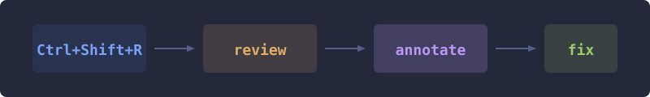

# @alexeyco/pi-revdiff

<p align="center">
  
</p>

<p align="center">
  <strong>Interactive diff review for <a href="https://github.com/earendil-works/pi">Pi</a></strong>
</p>

<p align="center">
  <code>Ctrl+R</code> → review your diff → leave annotations → the agent fixes it
</p>

---

## Why

Code review should not happen in a separate window, a separate tool, or a
separate conversation. **pi-revdiff** keeps the entire loop inside your
terminal:

1. Press **Ctrl+R** — Pi launches an interactive diff viewer over your
   working tree.
2. Scroll the diff, **annotate** lines you want changed or questioned.
3. Close the viewer — your annotations are delivered to the agent as a
   steer message.
4. The agent reads each annotation, locates the code, and makes the fix.

No copy-paste. No context switching. No "hey can you look at this diff."

## Features

| | |
|---|---|
| **One shortcut** | `Ctrl+R` launches the full review loop — diff, annotate, fix. |
| **Full-screen TUI takeover** | Spawns revdiff directly as a child process — the same pattern as pi-hunk. Pi's TUI pauses, revdiff takes over the terminal, Pi restores when you quit. |
| **Native annotation capture** | Annotations flow through revdiff's `-o` output file — no shell launcher, no external wrapper scripts. |
| **Configurable delivery** | Annotations arrive as `steer` (during streaming) or `followUp` (queued after). |
| **Flexible scope** | Review all changes, staged-only, or against any Git ref. |
| **Non-git support** | Falls back to enumerating text files via `fd` when outside a git repository. |
| **Per-session config** | `/revdiff config` for interactive setup, or pass flags inline. |

## Install

You need **Node.js 22+**, **Pi**, and **revdiff** available on your `PATH`.
[Install revdiff separately](https://github.com/umputun/revdiff); pi-revdiff does not
download or manage it.

### As a Pi package (recommended)

```sh
pi install npm:@alexeyco/pi-revdiff
```

Or from git:

```sh
pi install git:github.com/alexeyco/pi-revdiff@v0.1.0
```

### As a local extension

```sh
git clone https://github.com/alexeyco/pi-revdiff.git
cd pi-revdiff
npm ci

# Install as a package
pi install .

# Or try without installing
pi -e .
```

### As an extension file

```sh
# Global (all projects)
cp -r pi-revdiff ~/.pi/agent/extensions/pi-revdiff

# Or per-project
cp -r pi-revdiff .pi/extensions/pi-revdiff
```

Then restart Pi or run `/reload`.

## Usage

```
Ctrl+R
```

That's it. Pi opens the diff viewer. Annotate what you want, close the
viewer, and the agent handles the rest.

### Configuration

Stored in `~/.pi/agent/pi-revdiff.json`:

```json
{
  "ref": "HEAD",
  "staged": false,
  "delivery": "steer"
}
```

| Key | Type | Default | Description |
|---|---|---|---|
| `ref` | string | `"HEAD"` | Default Git ref for diff |
| `staged` | boolean | `false` | Review staged changes only |
| `delivery` | `"steer"` \| `"followUp"` | `"steer"` | How annotations reach the agent |

- **steer** — annotations interrupt the current response (faster feedback).
- **followUp** — annotations queue after the current response finishes (non-blocking).

## How it works

```
┌──────────────┐     ┌──────────────┐     ┌──────────────┐
│   Ctrl+R     │────▶│   revdiff    │────▶│  Annotations │
│  (shortcut)  │     │  (child TUI) │     │  (-o file)   │
└──────────────┘     └──────────────┘     └──────┬───────┘
                                                 │
                                                 ▼
                                         ┌──────────────┐
                                         │    Agent     │
                                         │  (fixes it)  │
                                         └──────────────┘
```

1. **Ctrl+R** sends a steer message to the agent asking it to run a review.
2. The agent calls the `review` tool, which:
   - Runs `git add -A` to stage all changes.
   - Calls `ctx.ui.custom()` to take over the terminal.
   - Calls `tui.stop()` to release the screen.
   - Spawns `revdiff` as a child process with `stdio: "inherit"`.
3. You scroll, read, and **annotate** lines inside the revdiff TUI.
4. When you quit (`q`), revdiff writes annotations to a temp file.
5. The extension calls `tui.start()` to restore Pi's TUI, reads the
   annotation file, and returns the text to the agent.
6. The agent reads each annotation, locates the relevant code, and
   makes changes or explains its reasoning.

No shell launcher, no external wrapper — the extension manages the
full lifecycle directly.

## Keyboard shortcuts

| Key | Action |
|---|---|
| `Ctrl+R` | Launch diff review |

The extension shortcut takes precedence over Pi's built-in `Ctrl+R`
(session rename) when active.

Inside the revdiff TUI, all standard revdiff keys work:

| Key | Action |
|---|---|
| `j` / `k` | Navigate lines |
| `n` / `p` | Next / previous file |
| `a` / `Enter` | Annotate current line |
| `A` | Annotate whole file |
| `d` | Delete annotation |
| `@` | List annotations |
| `q` | Quit (flush annotations) |
| `Q` | Quit (discard annotations) |
| `?` | Show help |

## Requirements

- [Pi](https://github.com/earendil-works/pi) (latest release)
- [revdiff](https://github.com/umputun/revdiff) on `PATH`
- Node.js ≥ 22
- A Git repository in the current working directory (or `fd` for non-git projects)

## Development

```sh
npm ci
make check    # typecheck + tests
make fmt      # format with prettier
```

See [CONTRIBUTING.md](CONTRIBUTING.md) for development workflow and
release process.

## License

[MIT](LICENSE)
